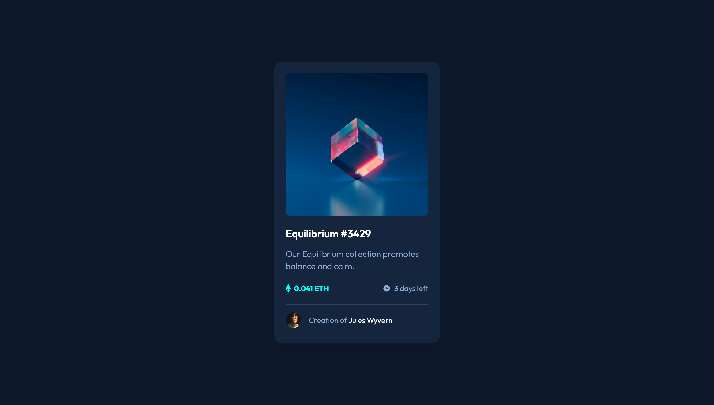

# Frontend Mentor - NFT preview card component solution

This is a solution to the [NFT preview card component challenge on Frontend Mentor](https://www.frontendmentor.io/challenges/nft-preview-card-component-SbdUL_w0U). Frontend Mentor challenges help you improve your coding skills by building realistic projects. 

## Table of contents

- [Overview](#overview)
  - [The challenge](#the-challenge)
  - [Screenshot](#screenshot)
  - [Links](#links)
- [My process](#my-process)
  - [Built with](#built-with)
  - [What I learned](#what-i-learned)

## Overview

### The challenge

Users should be able to:

- View the optimal layout depending on their device's screen size
- See hover states for interactive elements

### Screenshot



### Links

- Solution URL: [link](https://ruslanmsv.github.io/nft-card-component)

## My process

### Built with

- CSS custom properties
- Flexbox
### What I learned

Adding overlay with `background` CSS to HTML `` tag is overly complicated as fuck. 

In order to do that you have to wrap `` into wrapper container and put an overlay container next to `` tag, so the hole construct looks kinda like that:

```html
<div class="wrapper">
  " />
  <div class="overlay"></div>
</div>
```